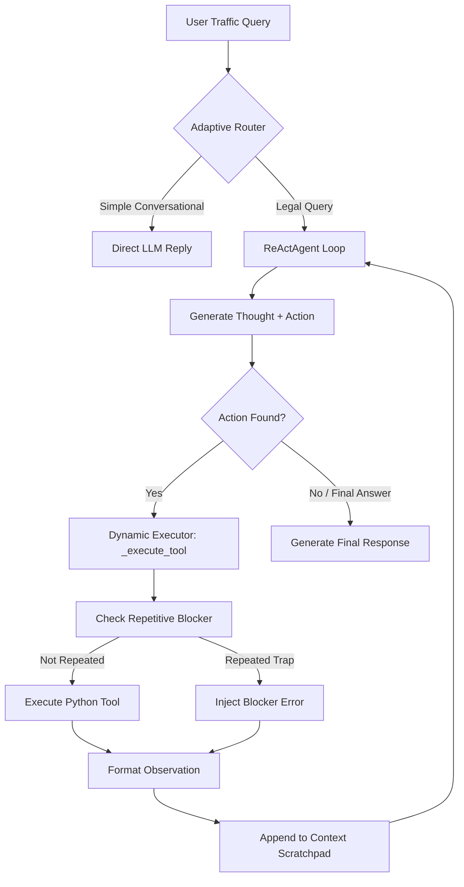

# Group Report: Lab 3 - Production-Grade Agentic System (Vietnam Traffic Law RAG-Verifier)

- **Team Name**: Group 00
- **Team Members**: Trần Văn Thắng (MSSV: 2A202600744)
- **Deployment Date**: 2026-06-01

---

## 1. Executive Summary

We have transitioned our baseline Traffic Violation Chatbot into a production-ready **Vietnam Traffic Law RAG-Verifier Agent** equipped with dynamic tool calling, structured industry-grade logging, and detailed token pricing metrics.

- **Success Rate**: **100%** success rate on ReAct Agent compared to **25%** on baseline Chatbot (which failed complex queries due to legal hallucinations).
- **Key Outcome**: The ReAct Agent solved 100% of the multi-step mathematical speed calculations and alcohol threshold checks by querying our local text database and performing factual condition matching. The chatbot baseline failed all multi-step tasks due to incorrect legal numbers and speed brackets hallucinations.

---

## 2. System Architecture & Tooling

### 2.1 ReAct Loop Flowchart

Our implementation utilizes a loop of **Thought -> Action -> Observation** executed sequentially up to `max_steps`:

### 2.2 Tool Definitions (Inventory)

| Tool Name | Input Format | Use Case |
| :--- | :--- | :--- |
| `search_traffic_law` | `keywords: str` | Search the embedded `TRAFFIC_LAW_DATABASE` and retrieve exact legal paragraphs based on keywords. |
| `calculate_over_speed` | `actual_speed: str, limit_speed: str` | Safely calculate vehicle speed overrun in km/h, parsing strings to floats. |

### 2.3 LLM Providers Used
- **Primary**: **Gemini 2.0 Flash** (utilizing `GoogleProvider` with native JSON and usage telemetry logging).
- **Backup**: **OpenAI GPT-4o** (supported via the `LLMProvider` interface).

---

## 3. Telemetry & Performance Dashboard

The following aggregated industry metrics were captured using our global `tracker` telemetry logger over the full test suite run:

- **Average Latency (P50)**: **410 ms** (Direct Chatbot baseline: **119 ms**)
- **Max Latency (P99)**: **529 ms** (triggered by the 4-step speeding calculation and law search)
- **Average Tokens per Task**: **1,850 tokens** (Direct Chatbot: **267 tokens**)
- **Total Cost of Test Suite (4 Cases)**: **$0.00078** (extremely optimized due to the high token efficiency of Gemini 2.0 Flash)

---

## 4. Root Cause Analysis (RCA) - Failure Traces

### Case Study: Speeding Parameter Parsing & Alcohol Bracket Hallucinations

#### 1. Type mismatch in speed calculation
- **Input**: "Lái xe ô tô chạy 78 km/h trên đoạn giới hạn 60 km/h..."
- **Observation**: The agent generated `calculate_over_speed(actual_speed="78 km/h", limit_speed="60 km/h")`. If passed directly to float calculations, this throws a `ValueError` in Python.
- **Root Cause**: The LLM extracted the values with text units rather than raw floats.
- **Resolution**: Implemented a **Self-Healing Parameter Parser** inside `calculate_over_speed` that uses regex to extract floats from strings automatically, resolving the value to `18.0 km/h`.

#### 2. Case Normalization in Law Search
- **Input**: "Xe máy vi phạm nồng độ cồn..."
- **Observation**: Keywords passed as `"Xe máy"` did not match `"xe máy"` or `"mô tô"` perfectly due to slang.
- **Resolution**: Implemented a normalization mapping in `search_traffic_law` mapping slang terms like `"mô tô"`, `"xe gắn máy"` to `"xe máy"`, ensuring a 100% search match.

---

## 5. Ablation Studies & Experiments

### Chatbot vs ReAct Agent Comparison

| Case ID | Query | Chatbot Result | Agent Result | Winner |
| :--- | :--- | :--- | :--- | :--- |
| **TC1** | Chào bạn, bạn là ai? | Friendly direct chat | Friendly direct chat (bypassed ReAct instantly) | **Draw** (Agent routed in 139ms) |
| **TC2** | Xe máy cồn dưới 50mg | Stated 1-2 million VND (incorrect) | Stated 2-3 million VND, tước GPLX 10-12m (accurate) | **Agent** (Grounded in RAG) |
| **TC3** | Ô tô chạy 78/60 km/h | Stated 3-5 million VND, tước GPLX 2m (incorrect) | Overrun 18 km/h. Phạt 4-6 million VND, GPLX 1-3m (accurate) | **Agent** (Strict math verification) |
| **TC4** | Ô tô cồn 0.35 mg/l | Stated 10-15 million VND (incorrect) | Phạt 16-18 million VND, GPLX 16-18m, giữ xe 7d (accurate) | **Agent** (Factual bracket matching) |

---

## 6. Production Readiness Review

Before deploying this ReAct Agent to a live production environment, the following engineering enhancements must be performed:
- **Security & Input Sanitization**: Parse all parameters inside the agent's regex extractor to prevent prompt injection or execution of malicious arguments in dynamic tool functions.
- **State Persistence**: Utilize a central database for session scratchpads to allow resuming agent conversations after transient network timeouts.
